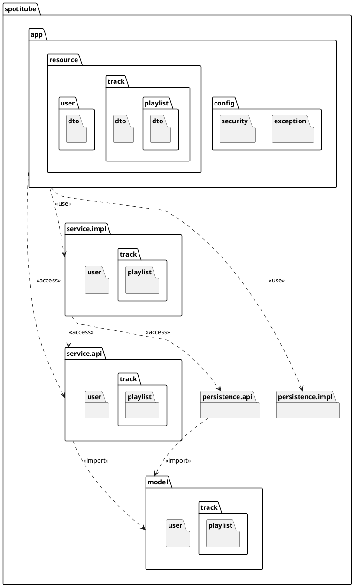

# Spotitube Design Document

Jens Broekens (1618608)
Teacher: Meron Brouwer

Course: HBO-ICT/OOSE-DEA
Date: May 26th, 2023
Version: 1

## Introduction
Spotitube is an application which allows the user to get an overview of their playlists from Spotify and YouTube in one place (hence the name). This project serves as the backend for Spotitube.

The backend consists of several RESTful services which consume and respond JSON messages.
It's implemented using at least the following frameworks/libraries:

* JAX-RS
* CDI
* JDBC

## Package Diagram


The [Layered Architecture](https://www.oreilly.com/library/view/software-architecture-patterns/9781491971437/ch01.html) pattern is used to differentiate between responsibilities within the application:
* The `app` package equates to the Application Layer and is responsible for handling communication between the clients and the business layer.
* The `service` packages equate to the service layer and are responsible for handling the business logic.
* The `persistence` packages equate to the Persistence Layer and are responsible for persisting domain types in a datastore.

The packages are structured in such a way that api and implementation are separated ([Separated Interface](https://www.martinfowler.com/eaaCatalog/separatedInterface.html)) and related packages are grouped. This not only lowers coupling, but also allows swapping underlying implementations. For example to change to a different datastore.

The [Data Mapper](https://martinfowler.com/eaaCatalog/dataMapper.html) pattern is used to abstract away from the datastore used. In the persistence API this is presented as a [Repository](https://www.martinfowler.com/eaaCatalog/repository.html) so that in the future the [Unit of Work](https://www.martinfowler.com/eaaCatalog/unitOfWork.html) pattern in combination with a query resolver can be implemented without having to change code on the persistence API consumers' side.

The domain model is kept as a separate package (`model`) as it is used across the layers.

## Deployment Diagram
```plantuml
frame Spotitube <<deployment>> {
    node containerd <<executionEnvironment>> {
        node "TomEE 9.0.0 MicroProfile" <<container>> as backend {
            artifact "app.war"
        }

        database "PostgreSQL 15" <<container>> as db {
            card User <<table>>
            card Performer <<table>>
            card Album <<table>>
            card Track <<table>>
            card Playlist <<table>>
            card PlaylistTrack <<table>>
        }
    }

    node "Nginx" <<web server>> as frontend {
        artifact "Spotitube Frontend"
    }
}

db -- backend : <<protocol>>\nTCP/IP
frontend -- backend : <<protocol>>\nJSON/HTTP
```

The backend can be deployed on any Jakarta EE-compliant application server with the necessary implementations. For this project TomEE 9.0.0 MicroProfile is used.

It is containerized, meaning it can be deployed to a container runtime. This helps alleviate the classic "It works on my machine" problem. Out of simplicity only a Docker Compose file is included in this project, but Kubernetes could also be used.

## Design Decisions

See the below files for design decisions (in no particular order):
* [Split api/implementation into separate modules to lower coupling](decisions/0001-split-into-separate-modules.md)
* [Use Jakarta EE to stay up-to-date with bugfixes and new features](decisions/0002-use-jakartaee-instead-of-javaee.md)
* [Use Gradle as build tool to keep project maintainable](decisions/0003-use-gradle-as-build-tool.md)
* [Use JaCoCo to enforce code coverage](decisions/0004-use-jacoco-to-enforce-code-coverage.md)
* [Use DataSource for database connections](decisions/0005-use-datasource-for-database-connections.md)
* [Use Docker to easily deploy locally](decisions/0006-use-docker-to-easily-deploy-locally.md)
* [Use Testcontainers for integration testing to ensure similar execution environment](decisions/0007-use-testcontainers-for-integration-testing.md)
* [Use Argon2(id) for password hashing to improve security](decisions/0008-use-argon2id-for-password-hashing.md)
* [Use Jakarta Bean Validation to validate arguments](decisions/0009-use-jakarta-bean-validation.md)
* [Implement generic NotFound/AlreadyExists exceptions instead of domain-type-specific ones](decisions/0010-generic-notfound-and-exists-exceptions.md)
* [Use JSON Web Tokens as authentication token to validate authorizations](decisions/0011-json-webtoken-as-authentication-token.md)
* [Utilize reflection for datastore deserialization](decisions/0012-utilize-reflection-for-datastore-deserialization.md)
